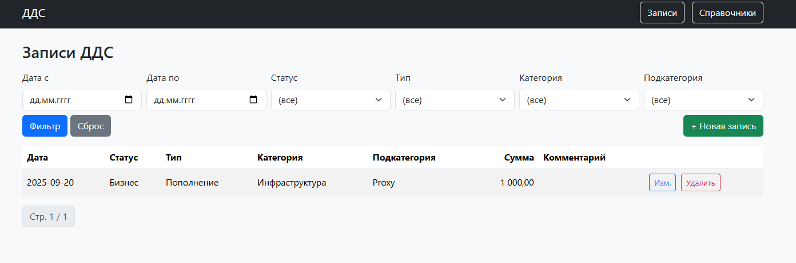
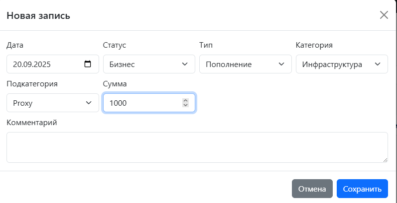
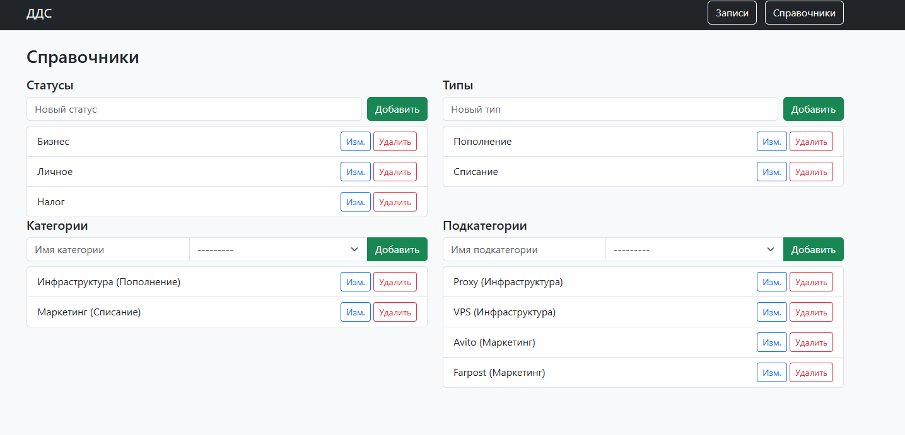

# CashFlowTestProject

## Стек

* **Python / Django** (Django REST Framework для API)
* **Postgres** при запуске в контейнере — см. `docker-compose.yml`)
* *Docker / Docker Compose*
* **HTML шаблоны** (папка `templates`) Bootstrap и JQuery

## Быстрый старт (Docker)

> Убедись, что установлены **Docker** и **Docker Compose** (или `docker` с встроенным `compose`).

1. Клонировать репозиторий:

```bash
git clone https://github.com/AN1CER784/CashFlowTestProject.git
cd CashFlowTestProject
```

2. Создать `.env` в корне, указать сл. переменные:
```bash
SECRET_KEY=
ALLOWED_HOSTS=
DEBUG=
POSTGRES_DB=
POSTGRES_USER=
POSTGRES_PASSWORD=
```

3. Собрать и запустить:

```bash
docker compose up --build
```

4. (Опционально) Применить фикстуры с тестовыми данными 
```bash
docker container exec -it cashflowtestproject-web-1 python manage.py loaddata dds/fixtures/initial.json
```

5. Создать суперпользователя (для входа в админку):

```bash
docker container exec -it cashflowtestproject-web-1 python manage.py createsuperuser
```

6. Открыть приложение:

* UI: [http://localhost:8000/](http://localhost:8000/)
* Админка: [http://localhost:8000/admin/](http://localhost:8000/admin/)

## Интерфейс
* Главная страница с записями


---
* Форма для добавления записи



---
* Страница со справочниками
* 
